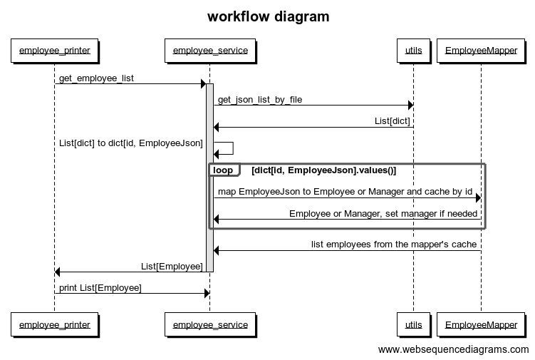
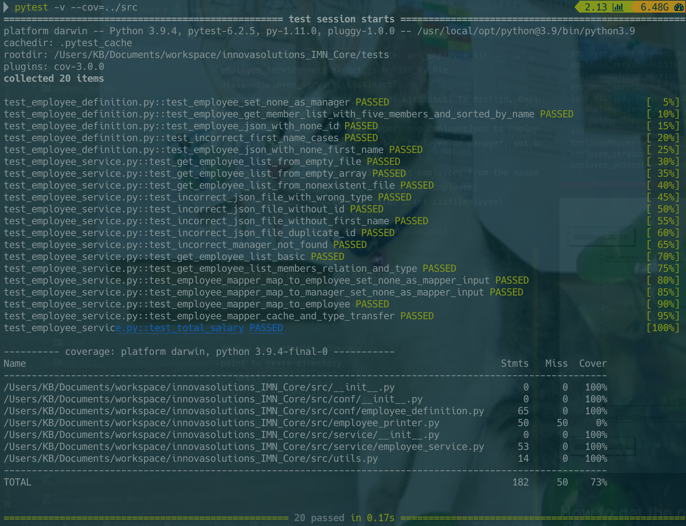

# IMN Coding Challenge

## Environment
- **Python**: 3.9.4
- **pytest**: 6.2.5 with plugin cov-3.0.0
- **pydantic**: 1.9.0

## Project Structure
```text
root
 - docs         
 - src        
 - tests
 - resources    
```

## Whole workflow
click [here](https://www.websequencediagrams.com) and paste the following if you want to edit
```text
title workflow diagram

employee_printer->+employee_service: get_employee_list
employee_service->utils: get_json_list_by_file
utils->employee_service: List[dict]
employee_service->employee_service: List[dict] to dict[id, EmployeeJson]
loop dict[id, EmployeeJson].values()
   employee_service->EmployeeMapper: map EmployeeJson to Employee or Manager and cache by id
   EmployeeMapper->employee_service: Employee or Manager, set manager if needed
end
EmployeeMapper->employee_service: list employees from the mapper's cache
employee_service->-employee_printer: List[Employee]
employee_printer->employee_service: print List[Employee]
```


## How to get the output
point to the project root directory, and start interactive application. It'll list available files in /resources, please 
copy the file name and paste it on command line to see the result.
```shell
python3 src/employee_printer.py
```


## How to test with coverage
point to tests directory
```shell
pytest -v --cov=../src
```


